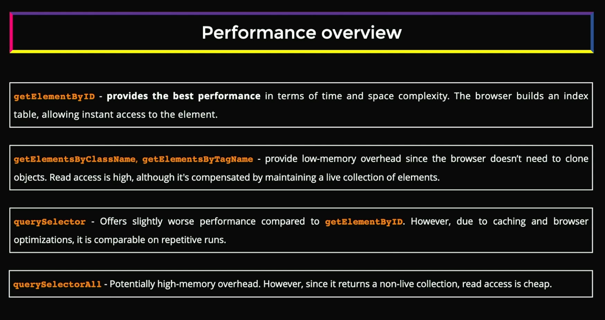
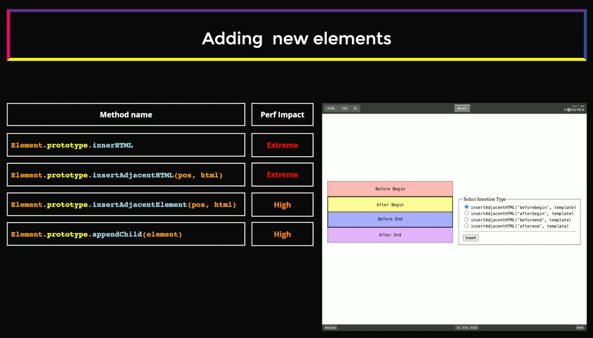

## DOM API

## Table of Contents

- [1. DOM and Querying](#dom-and-querying)
- [2. DOM Performance Best Practices](#dom-performance-best-practices)
- [3. DOM Templates and DocumentFragment](#dom-template-and-documentfragment)

## [DOM and Querying]()

The DOM API is a set of methods we can utilise in JavScript to manipulate the DOM.

**When to use:-**

- Building a low-level library (e.g virtualisation, DOM management etc)
- Creating Generic Component (like Video Player).

#### Why Different Methods Exist

The DOM API provides multiple methods for similar tasks because they serve different purposes and use cases:

- **Performance vs. Convenience**: Methods like `getElementById()` are faster but limited to IDs, while `querySelector()` is more flexible but slightly slower
- **Single vs. Multiple Elements**: `querySelector()` returns one element, while `querySelectorAll()` returns all matches - choose based on your needs
- **Live vs. Static Collections**: `getElementsByClassName()` returns a live HTMLCollection that updates automatically, while `querySelectorAll()` returns a static NodeList - use live collections when DOM changes matter
- **Browser Compatibility**: Older methods like `getElementsByTagName()` have better legacy browser support, while newer methods like `querySelector()` offer modern CSS selector syntax
- **Specificity**: Specialized methods like `getElementById()` or `getElementsByClassName()` make code intent clearer than generic selectors
- **Use Case Optimization**: Different methods are optimized for different scenarios - use the most specific method for better performance and readability

**Rule of Thumb**: Use `querySelector()`/`querySelectorAll()` for modern projects with complex selectors, and specific methods like `getElementById()` for simple, performance-critical operations.



## [DOM Performance Best Practices]()

### Performance Best Practices

DOM manipulation is one of the most expensive operations in web performance. Follow these practices to optimize:

**General Performance Tips:**
- **Use IDs for Core Containers**: Always use `id` attributes for main containers and use `getElementById()` for fastest access
- **Choose the Right Starting Point**: Start DOM queries from the closest parent container instead of `document` to reduce search scope
- **Minimize DOM Access**: Cache DOM references instead of querying repeatedly
- **Batch DOM Changes**: Group multiple DOM operations together to reduce reflows/repaints
- **Use Document Fragments**: When adding multiple elements, create them in a DocumentFragment first, then append once
- **Avoid Layout Thrashing**: Don't interleave reads and writes (e.g., reading `offsetHeight` then setting `style.height` in a loop)
- **Defer Non-Critical Updates**: Use `requestAnimationFrame()` for visual updates or `setTimeout()` for non-urgent changes

```javascript
// ❌ Bad: Searching from document root every time
const items = document.querySelectorAll('.item');

// ✅ Good: Use ID for core container
const container = document.getElementById('main-container'); // Fastest
const items = container.querySelectorAll('.item'); // Reduced search scope

// ✅ Good: Cache the container reference
const sidebar = document.getElementById('sidebar');
const sidebarItems = sidebar.querySelectorAll('.item');
const sidebarButtons = sidebar.querySelectorAll('button');
```

### Adding/Removing Elements 



[Run the dom-api.html code to understand the adding new elements](/frontend-system-design/dom-api.html)

**Adding Elements Efficiently:**
```javascript
// ❌ Bad: Multiple reflows
for (let i = 0; i < 1000; i++) {
    const div = document.createElement('div');
    document.body.appendChild(div); // Triggers reflow each time
}

// ✅ Good: Single reflow using DocumentFragment
const fragment = document.createDocumentFragment();
for (let i = 0; i < 1000; i++) {
    const div = document.createElement('div');
    fragment.appendChild(div);
}
document.body.appendChild(fragment); // Single reflow

// ✅ Good: Using insertAdjacentHTML for multiple elements
const html = Array.from({length: 1000}, (_, i) => `<div>Item ${i}</div>`).join('');
container.insertAdjacentHTML('beforeend', html);
```

**Removing Elements Efficiently:**
```javascript
// ❌ Bad: Removing elements one by one
items.forEach(item => item.remove());

// ✅ Good: Remove parent or use innerHTML
container.innerHTML = ''; // Fast but loses event listeners

// ✅ Better: Remove parent and replace
const newContainer = container.cloneNode(false);
container.parentNode.replaceChild(newContainer, container);

// ✅ Good: Hide instead of remove (if reusing later)
container.style.display = 'none';
```

**Key Takeaways:**
- Use `DocumentFragment` for adding multiple elements
- Batch operations to minimize reflows
- Consider `insertAdjacentHTML` for large HTML insertions
- Cache DOM references to avoid repeated queries
- Hide elements instead of removing them if they'll be reused

## [DOM Template and DocumentFragment]()

**`<template>` Element:**

The `<template>` element is a mechanism for holding HTML that should not be rendered immediately when the page loads. It's useful for:
- Storing reusable HTML structures
- Cloning DOM structures without parsing HTML strings
- Creating client-side templates that can be instantiated multiple times

```html
<!-- Define template in HTML -->
<template id="user-card-template">
  <div class="user-card">
    
    <h3 class="name"></h3>
    <p class="email"></p>
  </div>
</template>
```

```javascript
// Use the template in JavaScript
const template = document.getElementById('user-card-template');
const clone = template.content.cloneNode(true); // Deep clone

// Populate with data
clone.querySelector('.avatar').src = user.avatar;
clone.querySelector('.name').textContent = user.name;
clone.querySelector('.email').textContent = user.email;

// Add to DOM
document.getElementById('users-container').appendChild(clone);
```

**`DocumentFragment`:**

A `DocumentFragment` is a lightweight container for holding DOM nodes. It's not part of the active DOM tree, so changes to it don't trigger reflows/repaints until it's appended to the document.

**Key Benefits:**
- **Performance**: Changes made to a fragment don't cause reflows
- **Batch Operations**: Collect multiple nodes before inserting them all at once
- **Memory Efficient**: Minimal overhead compared to creating a real DOM element
- **Clean Insertion**: When appended to DOM, only the children are inserted (not the fragment itself)

```javascript
// Creating multiple elements efficiently
const fragment = document.createDocumentFragment();

for (let i = 0; i < 1000; i++) {
  const div = document.createElement('div');
  div.textContent = `Item ${i}`;
  div.className = 'list-item';
  fragment.appendChild(div);
}

// Single DOM operation - much faster!
container.appendChild(fragment);
```

**Template vs DocumentFragment:**

| Feature | `<template>` | `DocumentFragment` |
|---------|-------------|-------------------|
| **Purpose** | Store reusable HTML | Batch DOM operations |
| **Definition** | Defined in HTML | Created in JavaScript |
| **Content** | Has `.content` property (which is a DocumentFragment) | Is the container itself |
| **Reusability** | Can be cloned multiple times | Single-use (children move to DOM on append) |
| **Use Case** | Component templates, repeated structures | Performance optimization for bulk inserts |

**Best Practices:**
- Use `<template>` when you have reusable HTML structures defined in your markup
- Use `DocumentFragment` when dynamically creating many elements in JavaScript
- Always clone `template.content` (it's a DocumentFragment) before modifying
- Combine both: use template for structure, fragment for batch operations

