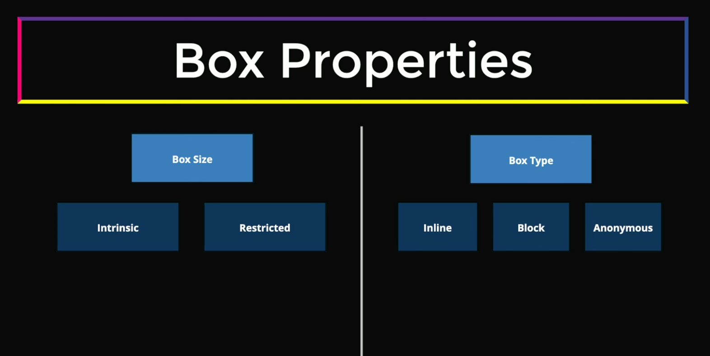
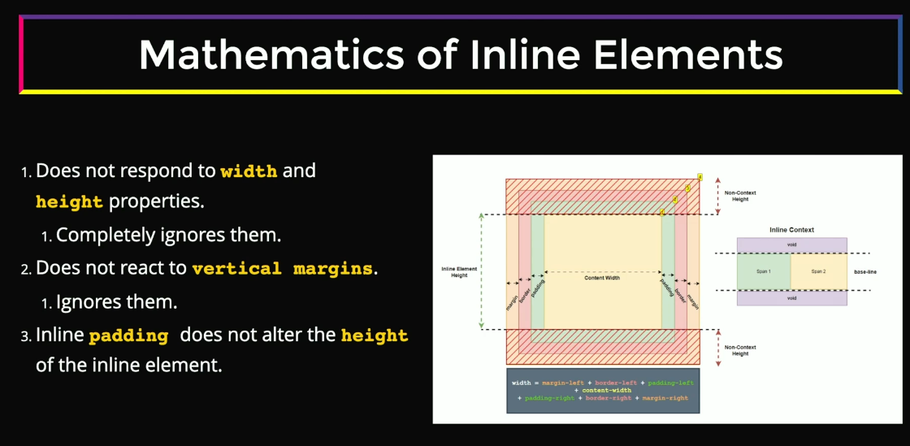
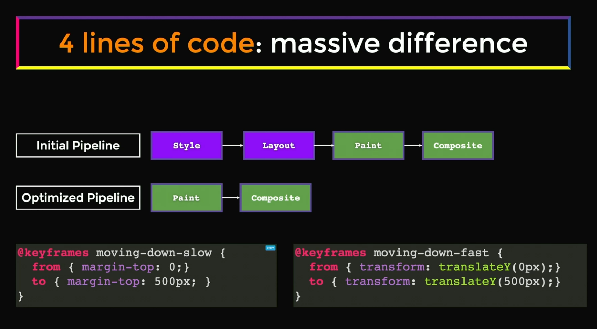
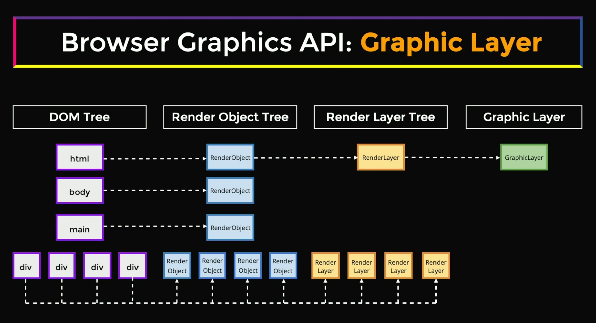
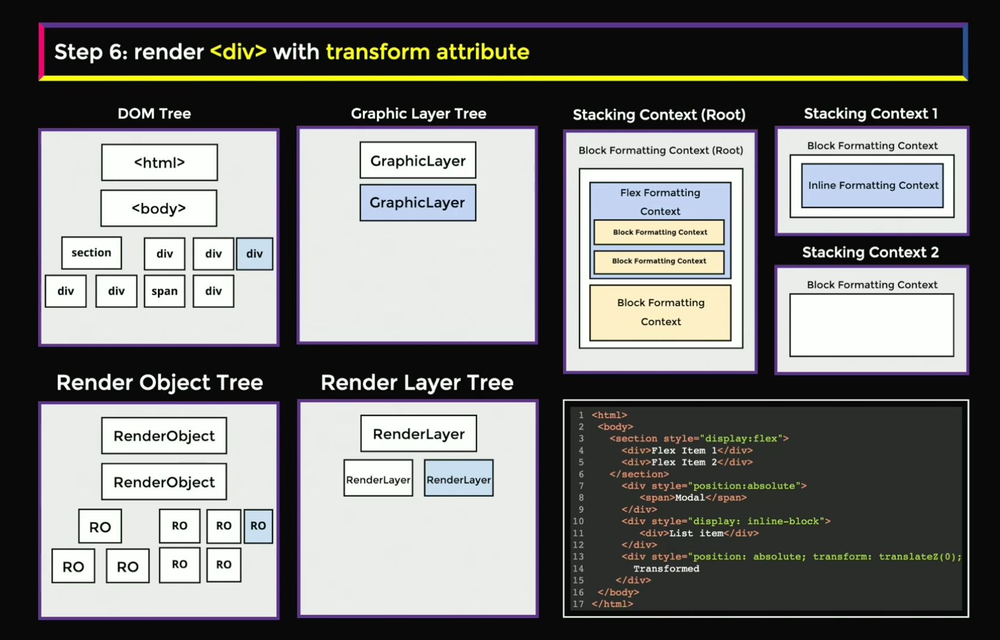

# Frontend System Design - Core Fundamentals

## Table of Contents

- [1. Box Model](#1-box-model)
- [2. Browser Formatting Context](#2-browser-formatting-context)
- [3. Browser Positioning](#3-browser-positioning)
- [4. Reflow and Rendering Pipeline](#4-reflow-and-rendering-pipeline)
- [5. Composition Layers](#5-composition-layers)
- [6. Browser Rendering Overview](#6-browser-rendering)

---

## [1. Box Model]()




### 1.1 Box Size

#### Intrinsic Size
- The box uses its content to determine the space it occupies

#### Restricted Size
- The box's size is governed by a set of rules applied to it:
  - `flex` or `grid` layout systems
  - `Percentage (%)` of parent size
  - The `aspect-ratio` property of images
  - The presence of other children in the DOM tree

### 1.2 Box Type

There are several types of boxes:

#### Block Level
- Block level elements take 100% of the `parent` container width
- The height of the content is equal to the `intrinsic size`
- The element is rendered from `top to bottom`
- They participate in `Block Formatting Context (BFC)`


#### Inline Level
- They render as a `string` flowing from left to right and from top to bottom
- They participate in `Inline Formatting Context (IFC)`
- They generate `inline-level boxes`



#### Anonymous Box
- Boxes created by the browser automatically in certain situations

---

## [2. Browser Formatting Context]()


---

## [3. Browser Positioning]()


> 💡 **Interactive Demo:** For a detailed understanding of positioning, run the [positioning-demo.html](positioning-demo.html) file

---

## [4. Reflow and Rendering Pipeline]()




### 4.1 Browser Rendering Pipeline

#### Initial Pipeline (Full Rendering)

When the browser first loads a page or makes significant changes:

```
HTML → DOM Tree
CSS → CSSOM Tree
       ↓
1. Style Calculation (Recalculate Style)
   - Combines DOM + CSSOM
   - Creates Render Tree
   - Determines which CSS rules apply to each element
       ↓
2. Layout (Reflow)
   - Calculates geometry (position, size)
   - Determines where each element goes
   - Most expensive operation
       ↓
3. Paint
   - Fills in pixels
   - Creates layers
   - Draws text, colors, images, borders, shadows
       ↓
4. Composite
   - Combines layers in correct order
   - Sends to GPU
   - Displays on screen
```

### 4.2 What is Reflow?

**Reflow (Layout)** is when the browser recalculates the positions and geometries of elements in the document.

#### Triggers Reflow (Expensive ⚠️)

**Changing Dimensions:**
- `width`, `height`, `padding`, `margin`, `border`

**Changing Position:**
- `top`, `left`, `right`, `bottom`, `position`

**Changing Layout Properties:**
- `display`, `float`, `flex`, `grid`
- Adding/removing DOM elements
- Changing font sizes or font families

**Reading Layout Properties (forces synchronous reflow):**
- `offsetWidth`, `offsetHeight`, `offsetTop`, `offsetLeft`
- `clientWidth`, `clientHeight`
- `scrollWidth`, `scrollHeight`
- `getComputedStyle()`
- `getBoundingClientRect()`

#### Why is Reflow Expensive?

Because changing one element's geometry can affect its:
- **Siblings** - Elements next to it
- **Parents** - Containers may need to resize
- **Children** - Content inside may need to reflow
- **Ancestors** - All the way up the tree

### 4.3 Optimized Pipeline: Paint → Composite

#### Skipping Layout (Better Performance ✅)

When you change **only visual properties** that don't affect geometry:

```
Style → Paint → Composite
```

**Triggers Paint Only (Not Layout):**
- `color`, `background-color`
- `visibility`
- `box-shadow`, `text-shadow`
- `border-style` (not `border-width`)
- `outline`

**Why This is Faster:**
- No need to recalculate positions
- Only pixels need to be redrawn

### 4.4 Most Optimized: Composite Only

#### Skipping Both Layout AND Paint (Best Performance 🚀)

When you change **only composite properties**:

```
Style → Composite
```

**Triggers Composite Only (GPU-accelerated):**
- `transform` (translate, rotate, scale)
- `opacity`
- `filter` (blur, brightness, etc.)
- `will-change` (tells browser to optimize)

**Why This is the Fastest:**
- Browser creates layers on GPU
- GPU handles the changes
- No main thread blocking
- Smooth 60fps animations

### 4.5 Practical Examples

#### ❌ Bad (Triggers Reflow)

```css
/* Moving element with left/top - causes reflow! */
.box {
  position: absolute;
  left: 100px; /* Reflow! */
  top: 100px;  /* Reflow! */
}
```

#### ✅ Good (Composite Only)

```css
/* Moving element with transform - composite only! */
.box {
  position: absolute;
  transform: translate(100px, 100px); /* GPU accelerated! */
}
```

#### ❌ Bad (Triggers Reflow)

```css
/* Changing width - causes reflow! */
.box {
  width: 200px; /* Reflow! */
}
```

#### ✅ Good (Composite Only)

```css
/* Scaling with transform - composite only! */
.box {
  transform: scaleX(1.5); /* GPU accelerated! */
}
```

### 4.6 Reading Layout Properties

#### Forced Synchronous Layout

##### ❌ Bad (Forces Reflow)

```javascript
// Reading layout properties forces immediate reflow
element.style.left = '100px';
const width = element.offsetWidth; // Forces reflow!
element.style.top = '50px';
const height = element.offsetHeight; // Forces another reflow!
```

##### ✅ Good (Batch Reads, Then Writes)

```javascript
// Read all at once
const width = element.offsetWidth;
const height = element.offsetHeight;

// Then write all at once
element.style.left = '100px';
element.style.top = '50px';
```

### 4.7 Performance Summary

| Operation | Pipeline | Speed | Use For |
|-----------|----------|-------|---------|
| **Change geometry** (`width`, `left`, `margin`) | Style → Layout → Paint → Composite | ⚠️ Slowest | Initial layout |
| **Change appearance** (`color`, `background`) | Style → Paint → Composite | ⚡ Faster | Visual updates |
| **Change composite** (`transform`, `opacity`) | Style → Composite | 🚀 Fastest | Animations |

### 4.8 Best Practices

1. **Use `transform` instead of `top/left/width/height`** for animations
2. **Use `opacity` instead of `visibility`** for fade effects
3. **Batch DOM reads and writes** to avoid forced reflows
4. **Use `will-change`** to hint optimization (sparingly)
5. **Use `requestAnimationFrame()`** for smooth animations
6. **Avoid layout thrashing** (alternating reads/writes)
7. **Use CSS containment** (`contain: layout`) to limit reflow scope

---

## Key Takeaway

> 💡 The fewer pipeline stages you trigger, the better the performance. Always prefer `transform` and `opacity` for animations because they only trigger compositing, which is GPU-accelerated and doesn't block the main thread! 🚀


---

## [5. Composition Layers]()



### 5.1 What are Composition Layers?

**Composition Layers** are separate surfaces that the browser creates for rendering different parts of a page. The compositor (GPU) combines these layers to produce the final display.

Think of layers like **transparent sheets** - each can be moved or transformed independently without affecting others.

### 5.2 CPU vs GPU Acceleration

#### CPU (Main Thread) Processing
**When Used:**
- Initial page load and layout calculation
- DOM manipulation and JavaScript execution
- Style calculation (matching CSS rules)
- Layout (Reflow) - calculating positions and sizes
- Paint - rasterizing (drawing pixels)

**Characteristics:**
- ⚠️ Blocks the main thread
- Sequential processing
- Slower for graphics operations
- Handles logic and calculations

#### GPU (Hardware) Acceleration
**When Used:**
- Compositing layers together
- Transforming layers (`transform`)
- Changing layer opacity (`opacity`)
- Applying filters (`filter`)
- Video and canvas rendering

**Characteristics:**
- ✅ Runs on separate hardware
- Parallel processing
- Very fast for graphics
- Doesn't block main thread
- Enables 60fps animations

### 5.3 CPU vs GPU: The Pipeline

#### CPU-Heavy Pipeline (Slowest ⚠️)
```
Change width/height/position
    ↓ CPU
Style Calculation
    ↓ CPU
Layout (Reflow) - Expensive!
    ↓ CPU
Paint - Draw pixels
    ↓ GPU
Composite
```

**Properties:** `width`, `height`, `margin`, `padding`, `top`, `left`, `position`, `display`

#### Paint-Only Pipeline (Faster ⚡)
```
Change color/shadow
    ↓ CPU
Style Calculation
    ↓ CPU (Skip Layout!)
Paint - Redraw pixels
    ↓ GPU
Composite
```

**Properties:** `color`, `background-color`, `box-shadow`, `border-style`, `visibility`

#### GPU-Only Pipeline (Fastest 🚀)
```
Change transform/opacity
    ↓ CPU
Style Calculation
    ↓ GPU (Skip Layout & Paint!)
Composite - GPU transforms layer
```

**Properties:** `transform`, `opacity`, `filter`

### 5.4 When Layers are Created

The browser creates a **GPU layer** when:

1. **3D Transforms**
   ```css
   .element {
     transform: translateZ(0);     /* GPU layer */
     transform: rotate3d(1,0,0,45deg); /* GPU layer */
   }
   ```

2. **Animated Transform/Opacity**
   ```css
   .element {
     animation: slide 1s;
   }
   @keyframes slide {
     to { transform: translateX(100px); } /* GPU layer */
   }
   ```

3. **`will-change` Property**
   ```css
   .element {
     will-change: transform, opacity; /* Hints GPU layer */
   }
   ```

4. **Special Elements**
   - `<video>`, `<canvas>`, `<iframe>`
   - `position: fixed` elements
   - Elements with CSS filters

### 5.5 CPU vs GPU: Performance Comparison

| Operation | Processor | Blocks Main Thread? | Speed | Example |
|-----------|-----------|---------------------|-------|---------|
| **Layout (Reflow)** | CPU | ✅ Yes | ⚠️ Slowest | `width`, `height`, `margin` |
| **Paint** | CPU | ✅ Yes | ⚡ Medium | `color`, `background` |
| **Composite** | GPU | ❌ No | 🚀 Fastest | `transform`, `opacity` |

### 5.6 Practical Examples

#### ❌ CPU-Based (Janky Animation)
```css
/* Uses CPU for layout every frame */
@keyframes slide-cpu {
  from { left: 0; }
  to { left: 300px; }
}

.box {
  position: absolute;
  animation: slide-cpu 1s;
  /* CPU recalculates layout 60 times/second - SLOW! */
}
```

#### ✅ GPU-Based (Smooth Animation)
```css
/* Uses GPU compositing only */
@keyframes slide-gpu {
  from { transform: translateX(0); }
  to { transform: translateX(300px); }
}

.box {
  position: absolute;
  animation: slide-gpu 1s;
  /* GPU transforms layer - FAST! 60fps guaranteed */
}
```

### 5.7 Layer Memory Cost

**GPU layers consume memory:**
- Small element: ~few KB
- Large element: ~few MB
- Full-screen layer: ~10-20 MB

**Formula:**
```
Memory = Width × Height × 4 bytes (RGBA)

Example: 1920×1080 layer
= 1920 × 1080 × 4
= 8,294,400 bytes ≈ 8 MB
```

### 5.8 Best Practices

#### ✅ Do: Force GPU for Animations
```css
.animated {
  will-change: transform; /* Create GPU layer */
  transform: translateZ(0); /* Or use 3D transform */
}
```

#### ❌ Don't: Over-Layer
```css
/* BAD: Creates layer for EVERY element! */
* {
  will-change: transform; /* Memory waste! */
}
```

#### ✅ Do: Clean Up Layers
```javascript
element.addEventListener('animationend', () => {
  element.style.willChange = 'auto'; // Free GPU memory
});
```

#### ✅ Do: Use Transform Instead of Position
```css
/* ❌ CPU: Causes reflow */
.box { left: 100px; }

/* ✅ GPU: Composite only */
.box { transform: translateX(100px); }
```

### 5.9 Viewing Layers in DevTools

**Chrome DevTools:**
1. F12 → More tools → Layers
2. See all GPU layers and memory usage

**Check what triggers what:**
- Visit: [csstriggers.com](https://csstriggers.com)
- Shows which properties trigger Layout/Paint/Composite

---

### Key Takeaway: CPU vs GPU

> 💡 **CPU handles logic and layout, GPU handles graphics.** 
> 
> Use CPU properties (`width`, `margin`) for initial layout. Use GPU properties (`transform`, `opacity`) for animations. 
>
> Creating GPU layers is powerful but uses memory - only promote animated elements to layers!

## [6. Browser Rendering]()



### How Browsers Render Web Pages

When you load a web page, the browser follows a specific sequence of steps to display content on screen:

#### The Complete Flow

```
1. Parse HTML → DOM Tree
   └─ Browser reads HTML and creates Document Object Model

2. Parse CSS → CSSOM Tree
   └─ Browser reads CSS and creates CSS Object Model

3. Combine DOM + CSSOM → Render Tree
   └─ Only visible elements (excludes display:none, <head>, etc.)

4. Layout (Reflow)
   └─ Calculate exact position and size of each element
   └─ Box model calculations happen here

5. Paint
   └─ Fill in pixels: text, colors, images, shadows
   └─ Creates layers for different parts of the page

6. Composite
   └─ Combine all layers in correct order
   └─ Send to GPU → Display on screen
```

#### Critical Rendering Path

The **Critical Rendering Path** is the sequence of steps to render the first pixels on screen:

1. **HTML** → DOM
2. **CSS** → CSSOM
3. **DOM + CSSOM** → Render Tree
4. **Layout** → Calculate geometry
5. **Paint** → Rasterize pixels
6. **Composite** → Display

**Goal:** Minimize the time to first render (First Contentful Paint)

#### Browser Rendering Engines

| Browser | Rendering Engine | JavaScript Engine |
|---------|------------------|-------------------|
| Chrome | Blink | V8 |
| Firefox | Gecko | SpiderMonkey |
| Safari | WebKit | JavaScriptCore |
| Edge | Blink | V8 |

#### Key Performance Metrics

- **FCP (First Contentful Paint)** - When first content appears
- **LCP (Largest Contentful Paint)** - When main content is visible
- **TTI (Time to Interactive)** - When page becomes interactive
- **CLS (Cumulative Layout Shift)** - Visual stability measure

---