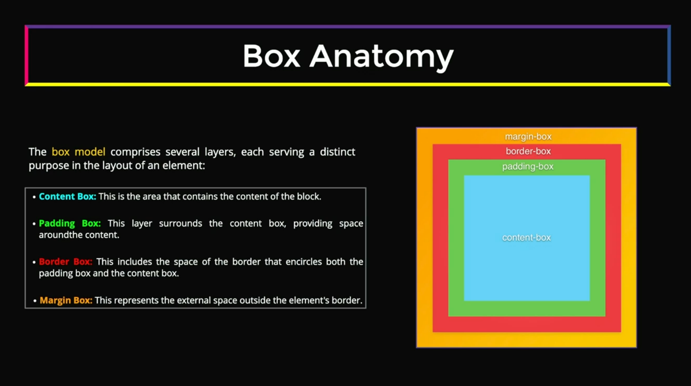
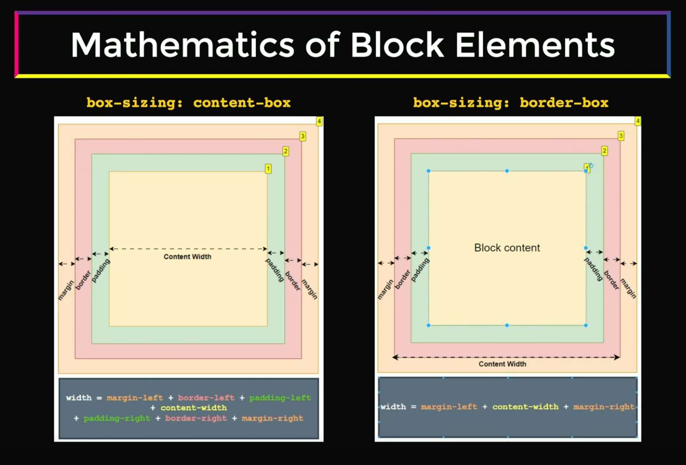
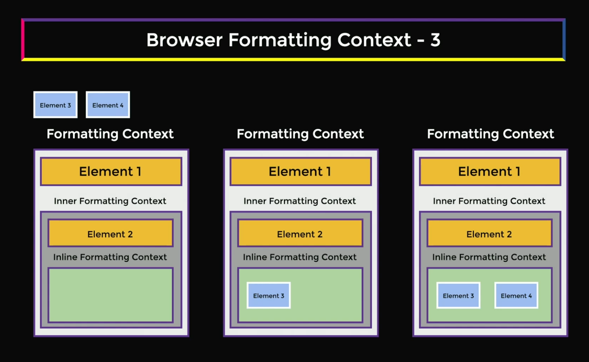
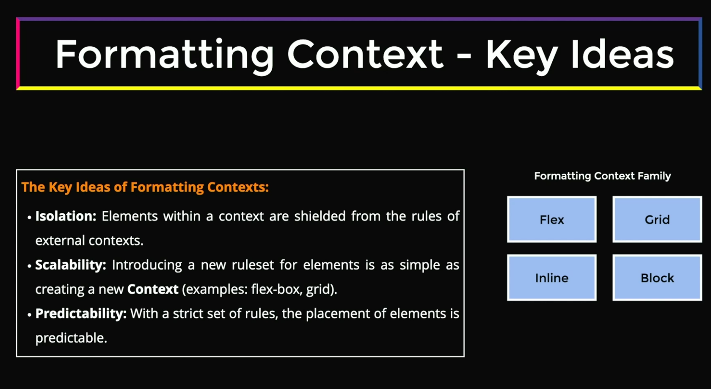
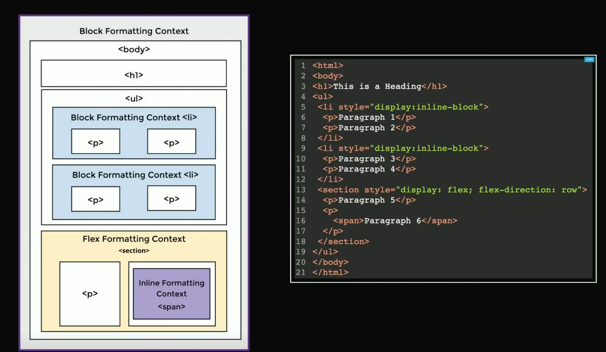

# Frontend System Design (FRONTEND MASTERS)

## Core Fundamentals

### Indexing

#### [Box Model](#box-model)
#### [Browser Formatting Context](#browser-formatting-context-1)

### Box Model

#### Box Size

- **Intrinsic** : This means that box uses its content to determine the space its occupies
- **Restricted**: This indicates that the box's size is governed by set of rules applied to it. It can be

  - `flex` or `grid` layout systems.
  - `Percentage (%)` of parent size.
  - The `aspect-ratio` property of images, etc.
  - The presence of other children in the DOM tree.

#### Box Type

- **There are several types of boxes**

  - `block` level (including, but not restricted display block)
    - Block level elements takes 100% of the `parent` container width.
    - The height of the content is equal to the `intrinsic size`.
    - The element is rendered from `top to bottom`.
    - They participate in `Block Formatting Context (BFC)`.
    - 
  - `inline` level
    - They render as a `string` flowing from left to right and from top bottom.
    - They participate in `Inline Formatting Context (IFC)`.
    - They generate `inline-level boxes`.
    - 
  - `Anonymous` box

### Browser Formatting Context

