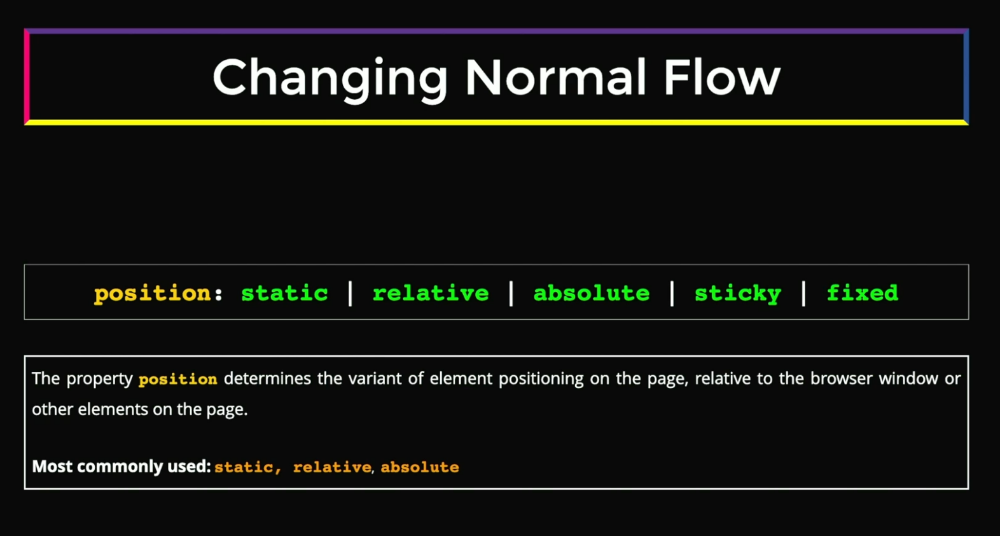
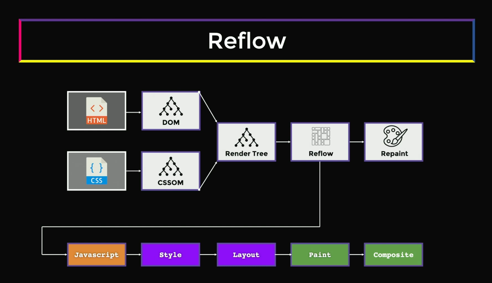

# Frontend System Design (FRONTEND MASTERS)

## Core Fundamentals

### Indexing

#### [Box Model](#box-model)
#### [Browser Formatting Context](#browser-formatting-context-1)
#### [Browser Positioning](#browser-positioning-1)
#### [Reflow](#reflow-1)

### Box Model


#### Box Size

- **Intrinsic** : This means that box uses its content to determine the space its occupies
- **Restricted**: This indicates that the box's size is governed by set of rules applied to it. It can be

  - `flex` or `grid` layout systems.
  - `Percentage (%)` of parent size.
  - The `aspect-ratio` property of images, etc.
  - The presence of other children in the DOM tree.

#### Box Type

- **There are several types of boxes**

  - `block` level (including, but not restricted display block)
    - Block level elements takes 100% of the `parent` container width.
    - The height of the content is equal to the `intrinsic size`.
    - The element is rendered from `top to bottom`.
    - They participate in `Block Formatting Context (BFC)`.
    - 
  - `inline` level
    - They render as a `string` flowing from left to right and from top bottom.
    - They participate in `Inline Formatting Context (IFC)`.
    - They generate `inline-level boxes`.
    - 
  - `Anonymous` box

### Browser Formatting Context


### Browser Positioning


  - If you want to understand positioning in detail, run the [position-demo.html](/frontend-system-design/positioning-demo.html) 

### Reflow



## Browser Rendering Pipeline

### Initial Pipeline (Full Rendering)
When the browser first loads a page or makes significant changes:

```
HTML → DOM Tree
CSS → CSSOM Tree
       ↓
1. Style Calculation (Recalculate Style)
   - Combines DOM + CSSOM
   - Creates Render Tree
   - Determines which CSS rules apply to each element
       ↓
2. Layout (Reflow)
   - Calculates geometry (position, size)
   - Determines where each element goes
   - Most expensive operation
       ↓
3. Paint
   - Fills in pixels
   - Creates layers
   - Draws text, colors, images, borders, shadows
       ↓
4. Composite
   - Combines layers in correct order
   - Sends to GPU
   - Displays on screen
```

---

## What is Reflow?

**Reflow (Layout)** is when the browser recalculates the positions and geometries of elements in the document.

### Triggers Reflow (Expensive ⚠️):
- Changing dimensions: `width`, `height`, `padding`, `margin`, `border`
- Changing position: `top`, `left`, `right`, `bottom`, `position`
- Changing layout properties: `display`, `float`, `flex`, `grid`
- Adding/removing DOM elements
- Changing font sizes or font families
- Reading layout properties (forces synchronous reflow):
  - `offsetWidth`, `offsetHeight`, `offsetTop`, `offsetLeft`
  - `clientWidth`, `clientHeight`
  - `scrollWidth`, `scrollHeight`
  - `getComputedStyle()`
  - `getBoundingClientRect()`

### Why is Reflow Expensive?
Because changing one element's geometry can affect its:
- Siblings (elements next to it)
- Parents (containers may need to resize)
- Children (content inside may need to reflow)
- Ancestors (all the way up the tree)

---

## Optimized Pipeline: Paint → Composite

### Skipping Layout (Better Performance ✅)
When you change **only visual properties** that don't affect geometry:

```
Style → Paint → Composite
```

**Triggers Paint Only** (Not Layout):
- `color`, `background-color`
- `visibility`
- `box-shadow`, `text-shadow`
- `border-style` (not `border-width`)
- `outline`

This is **faster** because:
- No need to recalculate positions
- Only pixels need to be redrawn

---

## Most Optimized: Composite Only

### Skipping Both Layout AND Paint (Best Performance 🚀)
When you change **only composite properties**:

```
Style → Composite
```

**Triggers Composite Only** (GPU-accelerated):
- `transform` (translate, rotate, scale)
- `opacity`
- `filter` (blur, brightness, etc.)
- `will-change` (tells browser to optimize)

This is **the fastest** because:
- Browser creates layers on GPU
- GPU handles the changes
- No main thread blocking
- Smooth 60fps animations

---

## Practical Examples

### ❌ Bad (Triggers Reflow):
```css
/* Moving element with left/top - causes reflow! */
.box {
  position: absolute;
  left: 100px; /* Reflow! */
  top: 100px;  /* Reflow! */
}
```

### ✅ Good (Composite Only):
```css
/* Moving element with transform - composite only! */
.box {
  position: absolute;
  transform: translate(100px, 100px); /* GPU accelerated! */
}
```

### ❌ Bad (Triggers Reflow):
```css
/* Changing width - causes reflow! */
.box {
  width: 200px; /* Reflow! */
}
```

### ✅ Good (Composite Only):
```css
/* Scaling with transform - composite only! */
.box {
  transform: scaleX(1.5); /* GPU accelerated! */
}
```

---

## Reading Layout Properties (Forced Synchronous Layout)

### ❌ Bad (Forces Reflow):
```javascript
// Reading layout properties forces immediate reflow
element.style.left = '100px';
const width = element.offsetWidth; // Forces reflow!
element.style.top = '50px';
const height = element.offsetHeight; // Forces another reflow!
```

### ✅ Good (Batch Reads, Then Writes):
```javascript
// Read all at once
const width = element.offsetWidth;
const height = element.offsetHeight;

// Then write all at once
element.style.left = '100px';
element.style.top = '50px';
```

---

## Performance Summary

| Operation | Pipeline | Speed | Use For |
|-----------|----------|-------|---------|
| **Change geometry** (`width`, `left`, `margin`) | Style → Layout → Paint → Composite | ⚠️ Slowest | Initial layout |
| **Change appearance** (`color`, `background`) | Style → Paint → Composite | ⚡ Faster | Visual updates |
| **Change composite** (`transform`, `opacity`) | Style → Composite | 🚀 Fastest | Animations |

---

## Best Practices

1. **Use `transform` instead of `top/left/width/height`** for animations
2. **Use `opacity` instead of `visibility`** for fade effects
3. **Batch DOM reads and writes** to avoid forced reflows
4. **Use `will-change`** to hint optimization (sparingly)
5. **Use `requestAnimationFrame()`** for smooth animations
6. **Avoid layout thrashing** (alternating reads/writes)
7. **Use CSS containment** (`contain: layout`) to limit reflow scope

---

**Key Takeaway:** The fewer pipeline stages you trigger, the better the performance. Always prefer `transform` and `opacity` for animations because they only trigger compositing, which is GPU-accelerated and doesn't block the main thread! 🚀