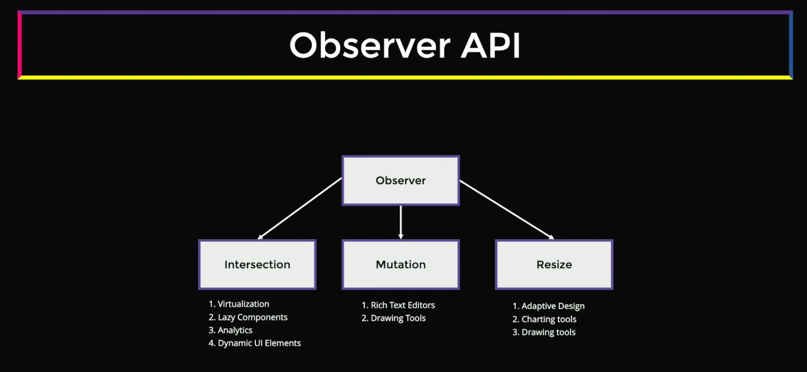

## Web APIs for Complex UI Patterns

## Table of Contents

- [1. Observer API](#observer-api)

## [Observer API]()

### Overview

The Observer APIs are a collection of modern browser APIs that allow you to efficiently observe changes to DOM elements and the viewport. These APIs are essential for building performant, complex UI patterns without relying on expensive polling or scroll event listeners.

